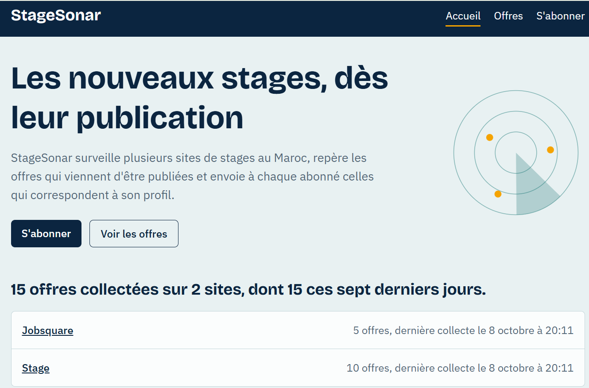
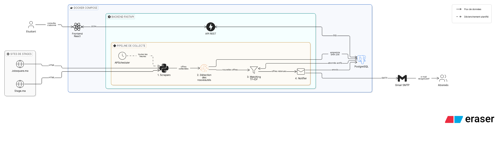
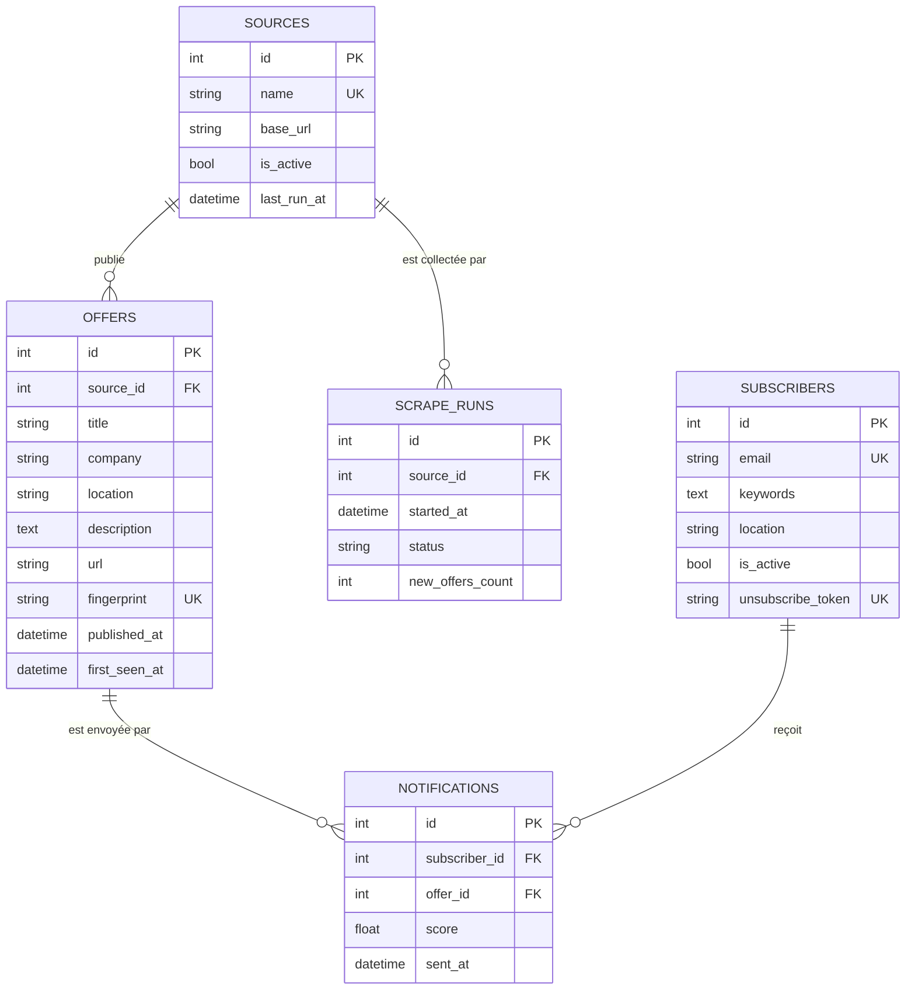

<h1 align="center">StageSonar</h1>

<p align="center">
  <strong>Veille automatique des offres de stage au Maroc.</strong><br>
  StageSonar surveille plusieurs sites de stages, repère les offres qui viennent d'être publiées<br>
  et envoie à chaque abonné celles qui correspondent à son profil.
</p>

<p align="center">
  
  
  
  
  
  
</p>

Projet du module de web mining, réalisé en binôme par **Youssef Ennagui** et **Fouad El ouafy**.

## Sommaire

- [Le projet en bref](#le-projet-en-bref)
- [Architecture](#architecture)
- [Le pipeline, étape par étape](#le-pipeline-étape-par-étape)
- [Où est le web mining](#où-est-le-web-mining)
- [Modèle de données](#modèle-de-données)
- [Stack technique](#stack-technique)
- [Démarrage rapide avec Docker](#démarrage-rapide-avec-docker)
- [Développement local](#développement-local)
- [Configuration](#configuration)
- [API](#api)
- [Tests](#tests)
- [Structure du projet](#structure-du-projet)
- [Collecte responsable](#collecte-responsable)
- [Limites et pistes d'amélioration](#limites-et-pistes-damélioration)
- [Équipe](#équipe)

## Le projet en bref

Un étudiant qui cherche un stage doit revenir chaque jour sur plusieurs sites et relire des listes
qu'il a déjà vues. StageSonar fait ce travail à sa place :

- **Collecte périodique** de plusieurs sites de stages, avec un scraper par site.
- **Détection des nouveautés** : une offre déjà vue n'est jamais stockée ni envoyée une deuxième fois.
- **Matching** entre chaque nouvelle offre et le profil de chaque abonné (mots-clés et ville).
- **Un seul e-mail récapitulatif** par abonné et par collecte, avec un lien de désinscription.
- **Interface web** pour consulter les offres, les filtrer et s'abonner.

## Aperçu

La page d'accueil résume l'état de la veille : le nombre d'offres collectées,
les nouveautés des sept derniers jours et la date de la dernière collecte de chaque site.

<p align="center">
  
</p>


## Architecture

<p align="center">
  <a href="docs/architecture.png">
    
  </a>
  <br>
  <em>Cliquer sur le schéma pour l'agrandir.</em>
</p>

Le schéma se lit de gauche à droite. Trois services tournent dans Docker Compose :

| Service | Rôle | Port |
|---|---|---|
| `frontend` | Application React : liste des offres, abonnement, désinscription | 5173 |
| `backend` | API REST FastAPI et pipeline de collecte, dans le même processus | 8000 |
| `db` | PostgreSQL : offres, abonnés, envois, journal des collectes | 5432 |

Le backend a deux rôles distincts. L'**API REST** répond au frontend. Le **pipeline de collecte**
tourne en arrière-plan : il est lancé par APScheduler, va chercher les offres sur les sites,
ne garde que les nouvelles, les compare aux abonnés et envoie les e-mails par Gmail SMTP.

## Le pipeline, étape par étape

Tout le pipeline tient dans une fonction, `run_pipeline()` (`backend/app/services/pipeline.py`).

| # | Étape | Ce qui se passe | Fichier |
|---|---|---|---|
| 1 | **Déclenchement** | APScheduler appelle `run_pipeline()` à intervalle régulier (`SCRAPE_INTERVAL_HOURS`). Une route d'administration permet aussi de le lancer à la main. | `main.py`, `routers/admin.py` |
| 2 | **Collecte** | Chaque site a son module, qui hérite de `BaseScraper` et renvoie les offres dans un format commun : titre, entreprise, ville, description, lien, date. | `scrapers/` |
| 3 | **Empreinte** | Titre, entreprise et ville sont normalisés (minuscules, sans accents, sans ponctuation), puis on calcule leur SHA-256. Le même stage publié sur deux sites donne la même empreinte. | `services/dedup.py` |
| 4 | **Détection** | Si l'empreinte n'existe pas en base, l'offre est nouvelle : elle est insérée et passe à l'étape suivante. Sinon elle est ignorée. | `services/dedup.py` |
| 5 | **Matching** | Chaque nouvelle offre devient un vecteur TF-IDF. Son score pour un abonné est la somme des poids des mots de l'offre qui figurent dans les mots-clés de l'abonné. L'offre est retenue si le score atteint `MATCH_THRESHOLD` et si la ville correspond. | `services/matcher.py` |
| 6 | **Notification** | Chaque abonné concerné reçoit un seul e-mail récapitulatif. L'envoi est enregistré pour ne jamais être répété. | `services/notifier.py` |

Deux choix rendent le pipeline robuste :

- **Un site en panne ne bloque pas les autres.** Chaque scraper est exécuté dans son propre
  `try/except`, et chaque exécution est journalisée dans la table `scrape_runs`.
- **Aucun doublon, même en cas de relance.** L'empreinte est protégée par une contrainte `UNIQUE`
  sur `offers`, et le couple (abonné, offre) par une contrainte `UNIQUE` sur `notifications`.

## Où est le web mining

Le web mining se divise en trois familles. StageSonar relève surtout de la première.

| Famille | Dans StageSonar |
|---|---|
| **Contenu** (*web content mining*) | Extraction des offres depuis le HTML, normalisation des champs, déduplication entre sites et pondération TF-IDF du texte des offres pour les rapprocher du profil d'un abonné. |
| **Structure** (*web structure mining*) | Peu exploitée : on conserve seulement le lien de chaque offre vers sa page d'origine. |
| **Usage** (*web usage mining*) | Extension possible : enregistrer les clics sur les offres envoyées pour affiner le profil de chaque abonné au fil du temps. |

## Modèle de données

Cinq tables, définies dans `backend/app/models.py`.



## Stack technique

| Couche | Outils |
|---|---|
| Backend | Python 3.12, FastAPI, SQLAlchemy 2, Pydantic |
| Collecte | httpx, BeautifulSoup |
| Planification | APScheduler |
| Matching | scikit-learn (`TfidfVectorizer`) |
| Base de données | PostgreSQL 16 (SQLite par défaut en développement) |
| E-mail | `smtplib`, Gmail SMTP |
| Frontend | React 19, TypeScript, Vite, Tailwind CSS 4, React Router |
| Déploiement | Docker, Docker Compose |
| Tests | pytest |

## Démarrage rapide avec Docker

Prérequis : [Docker Desktop](https://www.docker.com/products/docker-desktop/) et Git.

```bash
git clone https://github.com/ennaguiyoussef/stagesonar.git
cd stagesonar
cp .env.example .env          # Windows PowerShell : copy .env.example .env
docker compose up --build
```

Au premier démarrage, le backend crée les tables et enregistre les sites suivis.

| Adresse | Contenu |
|---|---|
| http://localhost:5173 | Application web |
| http://localhost:8000/docs | Documentation interactive de l'API |
| http://localhost:8000/health | État du backend |

La base est vide tant qu'aucune collecte n'a tourné. Pour lancer la première sans attendre le
planificateur :

```bash
curl -X POST http://localhost:8000/api/admin/scrape
# Windows PowerShell : curl.exe -X POST http://localhost:8000/api/admin/scrape
```

La réponse indique le nombre de nouvelles offres par site et le nombre d'e-mails envoyés :

```json
{ "new_offers": { "Jobsquare": 2, "Stage": 10 }, "emails_sent": 1 }
```

> Pour recevoir les e-mails, renseigner les variables `SMTP_*` et `MAIL_FROM` dans `.env`
> (voir [Configuration](#configuration)). Sans elles, la collecte fonctionne mais aucun e-mail ne part.

## Développement local

Le backend et le frontend tournent sur la machine, seule la base reste dans Docker.

**1. Base de données**

```bash
docker compose up -d db
```

Puis décommenter la ligne `DATABASE_URL` dans `.env`. Sans elle, l'application utilise un fichier
SQLite local.

**2. Backend**

```bash
cd backend
python -m venv .venv
source .venv/bin/activate      # Windows PowerShell : .venv\Scripts\Activate.ps1
pip install -r requirements.txt
python -m app.seed             # crée les tables et enregistre les sites suivis
uvicorn app.main:app --reload
```

**3. Frontend** (dans un second terminal)

```bash
cd frontend
npm install
npm run dev
```

## Configuration

Toute la configuration passe par le fichier `.env` à la racine, lu par `backend/app/config.py`.
Ce fichier contient des secrets : il est ignoré par Git et ne doit jamais être publié.

| Variable | Rôle | Valeur par défaut |
|---|---|---|
| `DATABASE_URL` | Connexion à la base | `sqlite:///./stagesonar.db` |
| `SCRAPE_INTERVAL_HOURS` | Intervalle entre deux collectes, en heures | `6` |
| `MATCH_THRESHOLD` | Score minimal pour qu'une offre soit envoyée | `0.2` |
| `REQUEST_DELAY_SECONDS` | Pause avant chaque requête vers un site | `2` |
| `USER_AGENT` | Identité annoncée aux sites collectés | `StageSonarBot/0.1 (projet universitaire)` |
| `SMTP_HOST`, `SMTP_PORT` | Serveur d'envoi | `smtp.gmail.com`, `587` |
| `SMTP_USER`, `SMTP_PASSWORD` | Compte Gmail et [mot de passe d'application](https://support.google.com/accounts/answer/185833) | vides |
| `MAIL_FROM` | Adresse d'expéditeur | vide |
| `FRONTEND_URL` | Adresse du frontend, utilisée pour CORS et pour les liens des e-mails | `http://localhost:5173` |

Avec Docker Compose, `DATABASE_URL` est fixée par `docker-compose.yml` pour pointer vers le
service `db`. Côté frontend, `VITE_API_URL` (dans `frontend/.env`) indique l'adresse de l'API si
elle n'est pas sur `http://localhost:8000`.

## API

| Méthode | Route | Description |
|---|---|---|
| `GET` | `/health` | État du backend |
| `GET` | `/api/offers` | Offres paginées, les plus récentes d'abord. Paramètres : `page`, `page_size`, `q` (titre ou entreprise), `city`, `source` |
| `GET` | `/api/sources` | Sites suivis et date de leur dernière collecte |
| `GET` | `/api/stats` | Nombre d'offres par site et nouvelles offres par jour sur 7 jours |
| `POST` | `/api/subscribers` | Abonnement, ou mise à jour si l'adresse existe déjà. Corps : `email`, `keywords`, `location` |
| `DELETE` | `/api/subscribers/{token}` | Désinscription par jeton |
| `POST` | `/api/admin/scrape` | Lance le pipeline immédiatement |

Exemple d'abonnement :

```bash
curl -X POST http://localhost:8000/api/subscribers \
  -H "Content-Type: application/json" \
  -d '{"email": "etudiant@example.com", "keywords": "data, python, machine learning", "location": "Casablanca"}'
```

`location` est un filtre de ville : laissé vide, l'abonné reçoit les offres de toutes les villes.

## Tests

```bash
cd backend
pytest
```

Les tests couvrent l'empreinte et la détection des nouveautés, l'analyse du HTML des sites (à
partir de pages enregistrées, sans appel réseau), le matching, les routes de l'API et le pipeline
complet avec un serveur SMTP simulé.

## Structure du projet

```
stagesonar/
├── backend/
│   ├── app/
│   │   ├── main.py            API, CORS et planificateur
│   │   ├── config.py          lecture du fichier .env
│   │   ├── database.py        connexion et session SQLAlchemy
│   │   ├── models.py          les cinq tables
│   │   ├── schemas.py         modèles Pydantic de l'API
│   │   ├── seed.py            enregistrement des sites suivis
│   │   ├── routers/           offers, subscribers, admin
│   │   ├── scrapers/          base.py + un module par site
│   │   └── services/          dedup, matcher, notifier, pipeline
│   ├── tests/
│   ├── Dockerfile
│   └── requirements.txt
├── frontend/
│   ├── src/
│   │   ├── api/client.ts      appels à l'API
│   │   ├── pages/             Home, Offers, Subscribe, Unsubscribe
│   │   └── App.tsx            navigation et routes
│   └── Dockerfile
├── docs/
│   └── architecture.png
├── docker-compose.yml
└── .env.example
```

**Ajouter un site** demande trois gestes : écrire une classe qui hérite de `BaseScraper` dans
`scrapers/`, l'ajouter à la liste `SCRAPERS` de `scrapers/__init__.py`, puis ajouter la ligne
correspondante dans `seed.py` avec exactement le même nom.

## Collecte responsable

- Le `robots.txt` de chaque site est lu avant d'écrire le scraper, et seules les pages autorisées
  sont collectées. Sur Jobsquare, les adresses de pagination sont interdites aux robots :
  StageSonar ne lit donc que la première page de la liste.
- Une pause de deux secondes précède chaque requête, et le robot s'identifie par un `User-Agent` explicite.
- Seules les informations publiques d'une offre sont stockées, et chaque offre renvoie vers sa page d'origine.
- Chaque e-mail contient un lien de désinscription.

## Limites et pistes d'amélioration

| Limite actuelle | Piste |
|---|---|
| Le matching TF-IDF ne connaît pas les synonymes (« IA » et « intelligence artificielle ») | Représentations sémantiques (embeddings de phrases) |
| Les poids TF-IDF sont calculés sur le seul lot de nouvelles offres | Calculer l'IDF sur tout l'historique des offres |
| Une même offre rédigée différemment sur deux sites n'est pas reconnue | Rapprochement approximatif des titres (similarité de chaînes) |
| Seule la première page de Jobsquare est lue | Collecte plus fréquente, ou accord avec le site |
| L'adresse e-mail n'est pas vérifiée à l'abonnement | E-mail de confirmation avant activation |
| La route `/api/admin/scrape` n'est pas protégée | Authentification avant toute mise en ligne |
| Les préférences sont déclarées une fois pour toutes | Web usage mining : apprendre des clics de l'abonné |

## Équipe

| Membre | Périmètre |
|---|---|
| [Youssef Ennagui](https://github.com/ennaguiyoussef) | Base de données, scraper Jobsquare, détection des nouveautés, planificateur, matching, pipeline, frontend, Docker |
| Fouad El ouafy | Scraper Stage.ma, API des offres, des sources et des statistiques, API des abonnés, e-mails |
| Ensemble | Choix des sites, tests de bout en bout, démonstration |

Méthode de travail : une tâche Trello, une branche, une pull request relue par l'autre membre du binôme.